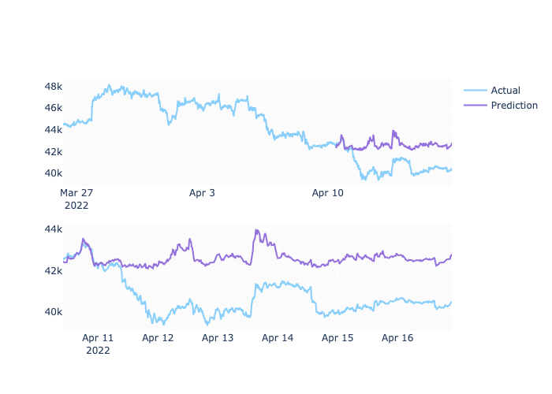
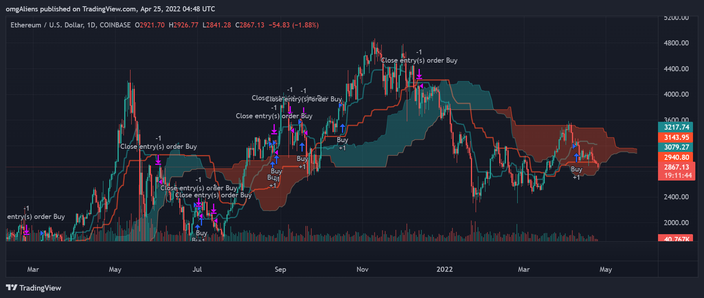

# Sleep and Trade Bot
---

This project contains a AI trading bot that trades cryptocurrency by using a combination of market indicators (such as MACD, SMA, Alligator, RSI, CCI, VWAP, Supertrend, etc.) to maximize returns, while minimizing maximum drawdown. To ensure the models work for a range of crypto this project backtests on two large value coins (BTC,ETH), two mid-sized coins (AVAX,BAT) and two small tokens (LINK, MATIC). The method is also tested on different time intervals (15m, 1hr, 4hr, and 1d). 
  
This bot trades cryptocurrencies using pine strategies in Tradingview. The pine strategies are optimized using machine learning techniques generated in a Jupyter Lab notebook using the XGBoost Algorithm and Linear Regression.

#### Bitcoin preditions based on 300 15 minute intervals

To use, open TradingView in your web browser. Select an asset and the time frame you wish to use. Open the strategies tab. Copy the text of the pine strategy file and paste into the strategy editor window. Save the strategy and apply it to the chart. This will also conveniently provide analytics for the given strategy.

To run the bot, tradingview provides a lot of options for execution using apis from a variety of brokers (including Alpaca, Gemini, Kraken, etc).

The ability to update the pine strategies automatically using the algorithms based on current market events is being developed; current strategies have been encoded using the results of the jupyter notebook files used for machine learning analysis of the indicator data.

  

---
### Technologies
Python 
Pandas 
Jupyter Lab 
Tradingview 
XGBoost 
SciKitLearn 

---
### Contributors
Loc Thai, Tim Tennyson, Rachel Bates, Daniel English, Kim Tung, Vic Gellon 

---
### License
MIT 

